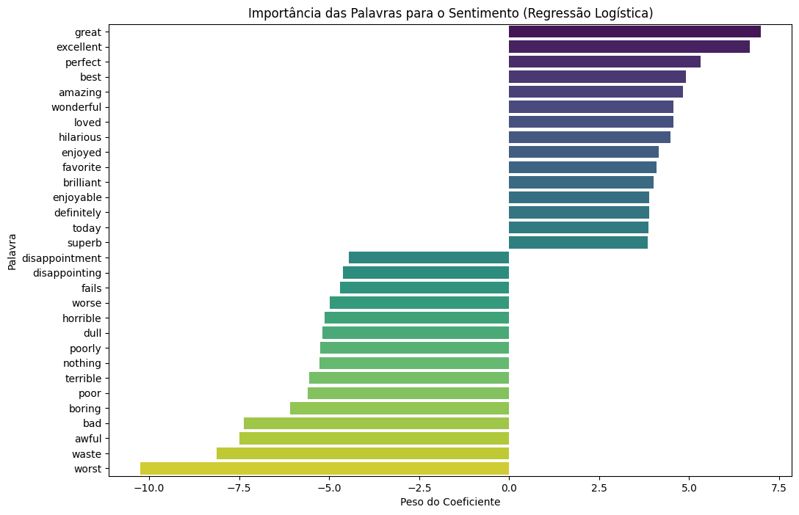

# NLP Review Classifier


## Sobre o Projeto

Este projeto implementa um pipeline de Machine Learning de ponta a ponta para classificar reviews de filmes do IMDb como **positivas** ou **negativas**. Utilizando técnicas de Processamento de Linguagem Natural (NLP), o objetivo é treinar um modelo de classificação capaz de entender o sentimento expresso em um texto e fazer previsões precisas.

O projeto abrange desde a aquisição e limpeza dos dados até o treinamento, avaliação comparativa de modelos e a exportação do artefato final (modelo treinado e vetorizador) para futuro uso em produção.

---

## Metodologia e MLOps

Este projeto foi estruturado utilizando o template **Cookiecutter Data Science**, uma escolha deliberada para seguir as melhores práticas de **MLOps (Machine Learning Operations)**.

Essa estrutura garante a **reprodutibilidade**, **organização** e **escalabilidade** do projeto, separando claramente os dados brutos, o código de processamento, os notebooks de exploração e os modelos treinados. Adotar essa metodologia desde o início facilita a manutenção, a colaboração e a eventual transição do modelo para um ambiente de produção.

---

## Pipeline do Projeto

O desenvolvimento foi dividido nas seguintes etapas, documentadas no notebook principal:

1.  **Análise Exploratória de Dados (EDA):**
    * Carregamento do dataset de 50.000 reviews do IMDb.
    * Verificação da estrutura, tipos de dados e valores ausentes.
    * Análise da distribuição das classes (`positivo`/`negativo`), confirmando que o dataset é perfeitamente balanceado.

2.  **Pré-Processamento de Texto (NLP):**
    * Remoção de tags HTML com expressões regulares (`regex`).
    * Padronização do texto para letras minúsculas.
    * **Tokenização:** Divisão do texto em palavras individuais (tokens) com `NLTK`.
    * **Remoção de Stopwords:** Filtragem de palavras comuns e sem significado de sentimento (ex: "the", "a", "is") e pontuações.

3.  **Engenharia de Features (Vetorização):**
    * Conversão do texto limpo em uma representação numérica que o modelo de ML possa entender, utilizando a técnica **TF-IDF (Term Frequency-Inverse Document Frequency)** com o `TfidfVectorizer` do `scikit-learn`.

4.  **Modelagem e Avaliação:**
    * Divisão dos dados em conjuntos de treino (80%) e teste (20%).
    * Treinamento e avaliação de dois modelos de classificação:
        * **Regressão Logística:** Um modelo linear, rápido e altamente interpretável.
        * **Random Forest:** Um modelo baseado em ensemble (comitê de árvores), mais complexo.
    * Comparação dos modelos com base em Acurácia, Precision, Recall e F1-Score.

5.  **Análise de Resultados e Interpretabilidade:**
    * A **Regressão Logística** foi selecionada como o melhor modelo, com **88.87% de acurácia** e um excelente equilíbrio entre tempo de treino e performance.
    * Foi gerada uma visualização dos coeficientes do modelo para identificar as palavras mais influentes nas previsões de sentimento positivo e negativo, demonstrando a interpretabilidade do modelo.

---

## Tecnologias Utilizadas
* **Linguagem:** Python 3.10
* **Bibliotecas Principais:**
    * **Análise de Dados:** Pandas, NumPy
    * **NLP:** NLTK
    * **Machine Learning:** Scikit-learn
    * **Visualização:** Matplotlib, Seaborn
* **Ambiente:** JupyterLab, Ambientes Virtuais (`venv`)

---

## Como Executar o Projeto

1.  **Clone o repositório:**
    ```bash
    git clone [https://github.com/SEU_USUARIO/SEU_REPOSITORIO.git](https://github.com/SEU_USUARIO/SEU_REPOSITORIO.git)
    cd SEU_REPOSITORIO
    ```

2.  **Crie e ative o ambiente virtual:**
    ```bash
    python3 -m venv venv
    source venv/bin/activate
    ```

3.  **Instale as dependências:**
    ```bash
    pip install -r requirements.txt
    ```

4.  **Baixe o Dataset:**
    * Faça o download do [IMDB Dataset of 50K Movie Reviews](https://www.kaggle.com/datasets/lakshmi25npathi/imdb-dataset-of-50k-movie-reviews) no Kaggle.
    * Mova o arquivo `IMDB Dataset.csv` para a pasta `data/raw/`.

5.  **Inicie o JupyterLab:**
    ```bash
    jupyter lab
    ```
    Navegue até a pasta `notebooks/` e abra o arquivo `.ipynb` principal para ver e executar a análise completa.

---

## Resultados

O modelo final de **Regressão Logística** alcançou uma performance robusta no conjunto de teste, com uma acurácia final de **88.87%**.

As métricas detalhadas por classe foram:

| Métrica | Negativo | Positivo |
| :--- | :---: | :---: |
| **Precision** | 0.90 | 0.88 |
| **Recall** | 0.88 | 0.90 |
| **F1-Score** | 0.89 | 0.89 |

### Interpretabilidade do Modelo
A análise dos coeficientes do modelo permitiu identificar as palavras que mais contribuem para cada sentimento.


